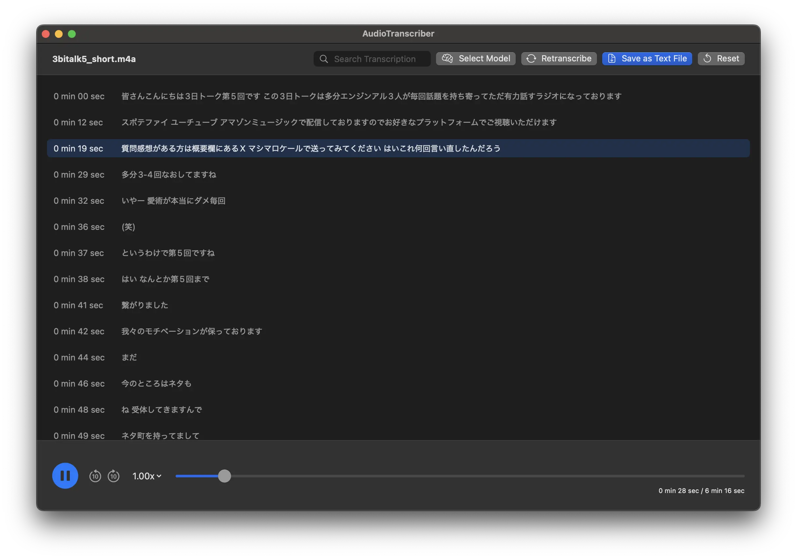

# AudioTranscriber

[Download here](https://github.com/0eta0/audio-transcriber/releases/download/v1.1.0/AudioTranscriber.macos.zip)

This is a locally running audio transcription application. Select audio or video files for transcription, and the currently playing part is highlighted in real-time.

|||
|---|---|
|||
|||

## Features

- Load audio files (MP3, WAV, M4A, FLAC, MP4, MOV, etc.)
- Local transcription using OpenAI's Whisper-based models
- Controls for video and audio playback, pause, seek, etc.
- Video display within the video window
- Highlighting of the currently playing text segment
- Click on transcribed text to play from that position
- Save transcribed text feature
- Selection of transcription models based on needs

## Technical Specifications

- Local speech recognition using mlx-whisper

## Requirements

- macOS 14.6 or later

## Development Environment

### Installation

To run locally, execute the following command:

```
make install
```

### When Editing Localization Files

If you edit localization files, execute the following command.
This generates the L10n enum, making it accessible in the code.

```
make swiftgen
```

### When Adding External Packages

If you add external packages, execute the following command.
This generates the license file.

```
make license
```

## Acknowledgements

This app uses the following external libraries.

[License](./AudioTranscriber/Resources/licenses.md)
